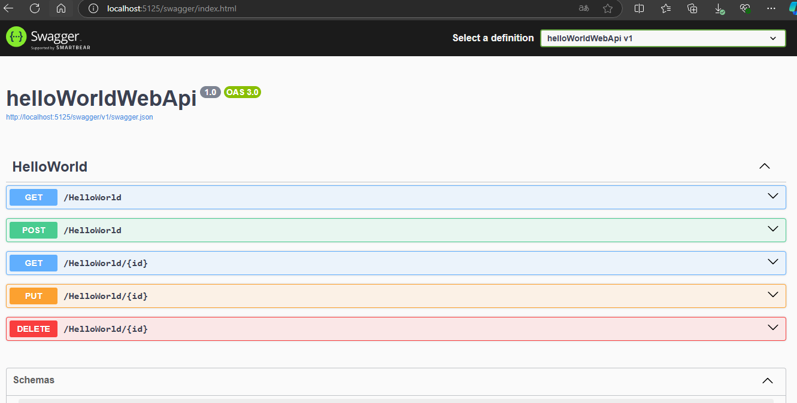

# HelloWorld API Project

## Introduction

This project is a simple API built with ASP.NET Core. It allows you to manage entries of type `HelloWorld`. Each entry has an identifier (`Id`) and a name (`Name`). This API uses Entity Framework Core to interact with a database.

## Migration Instructions

To add an initial migration and update the database, run the following commands in the terminal at the root of your project:

```bash
dotnet ef migrations add InitialCreate
dotnet ef database update 
```


## JSON Request Examples

Here are some examples of JSON requests that you can use to interact with the API:

### Retrieve all HelloWorld entries
- **Method**: GET
- **URL**: /HelloWorld

### Retrieve a HelloWorld entry by ID
- **Method**: GET
- **URL**: /HelloWorld/{id}

### Add a new HelloWorld entry
- **Method**: POST
- **URL**: /HelloWorld
- **Request Body**:
```json
{
    "Name": "Example HelloWorld"
}

Update a HelloWorld entry
Method: PUT
URL: /HelloWorld/{id}
Request Body:
{
    "Id": 1,
    "Name": "Updated HelloWorld"
}

Delete a HelloWorld entry
Method: DELETE
URL: /HelloWorld/{id}
Conclusion
This project provides a basic API for managing HelloWorld entries. You can extend this API by adding additional features according to your needs.
